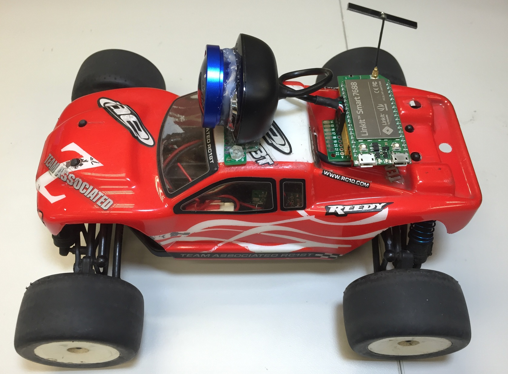
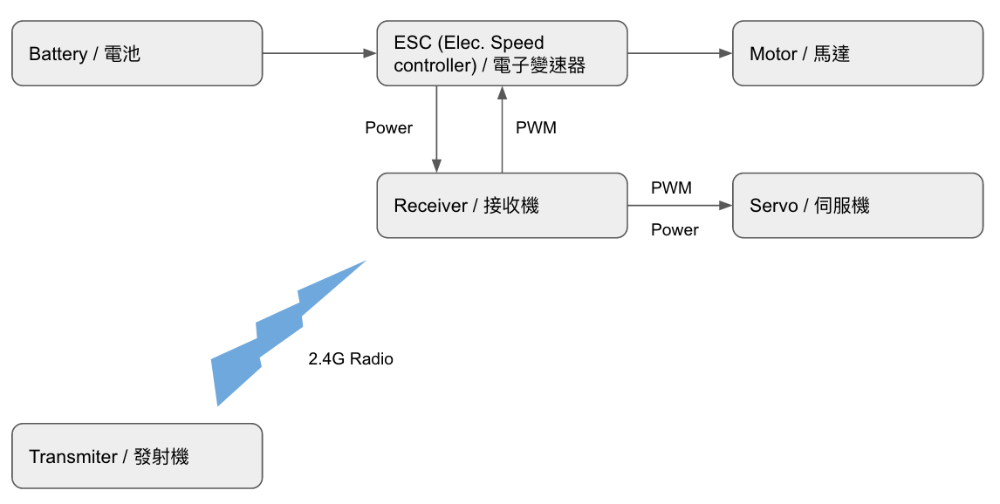
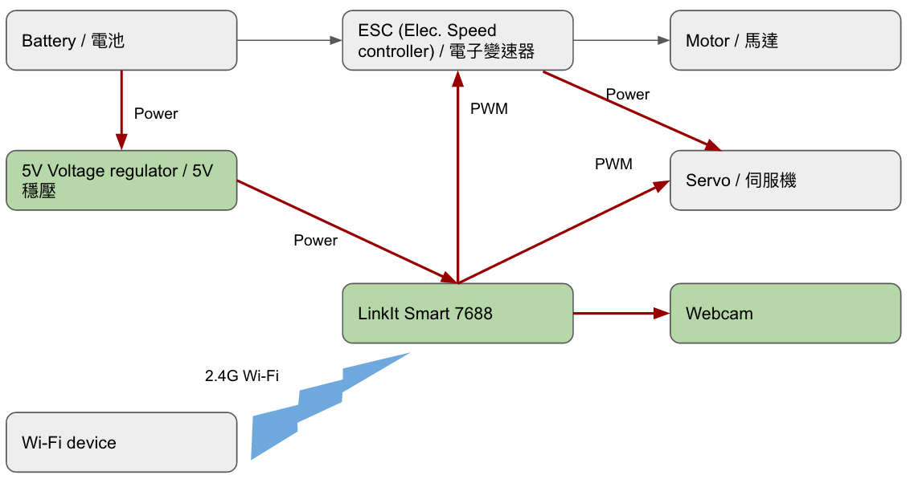
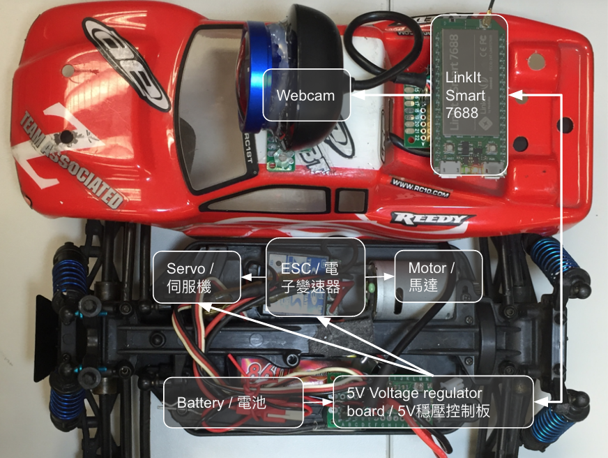
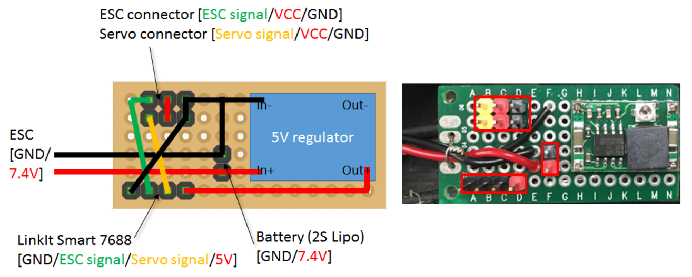
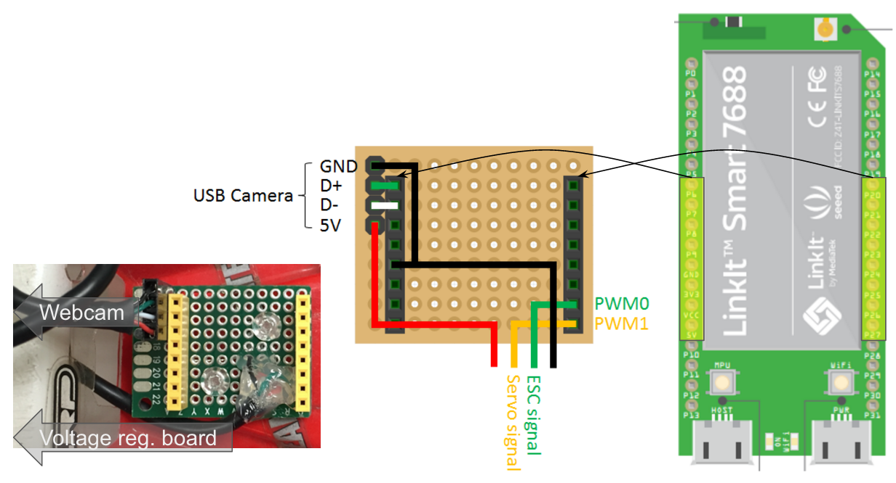

# 7688-fpv-rccar
FPV remote control radio car using LinkIt Smart 7688

For a quick understanding what does this project do, please check:

1. Youtube video
  * https://youtu.be/Q5iNWwBR6-w
1. Google presentation
  * https://goo.gl/3zruAJ 

Quick references:

* [Software part](#software-setup-instruction)
* [Hardware part](#hardware-setup-instruction)




## Software Setup Instruction
1. as root, do `npm install ws`
1. put fpvcarsrv.js to `/root`
1. put index.html & arrow.png to `/www/car/`
1. put init.cgi to `/www/cgi-bin`, and do `chmod 755 /www/cgi-bin/init.cgi`

#### Note
1. init.cgi will start both mjpg-streamer and websocket server, make sure there is `/root/fpvcarsrv.js`, if you want to rename/change the path, remember to modify init.cgi as well
1. mjpg-streamer will be listening port `8080` (which is hard-coded in init.cgi)
  * the default video settings will be “`320x240, 15fps`”
  * they can be specified at runtime by “`init.cgi?r=640x480&f=30`”
1. websocket server will be listening port 8001, hard-coded in fpvcarsrv.js

## How to Use/Start
1. Wait for 7688 ready after powering on
  1. check the Wi-Fi LED, it should be always on during bootup
  2. If 7688 is in AP mode, the LED will turn off after ready. And after a device (laptop or mobile) connect to it, the LED will start to blink
  3. If 7688 is in Station mode, the LED will be blinking if it connect to an AP.
2. Launch browser on your device and goes to "http://*hostname*/cgi-bin/init.cgi"
  1. If you want to specifiy camera resolution and fps, goes to "http://*hostname*/cgi-bin/init.cgi?r=640x480&f=30"
3. After a while, it should display following
```
starting mjpeg streamer (320x240, 15)... done
starting node server ... done
```
4. Click the `/car` hyperlink or goes to "http://*hostname*/car"


## Sources Files

### init.cgi

#### where
`/www/cgi-bin`
#### setup
`chmod 755 init.cgi`
#### note
init.cgi is written with **Python**, it is responsible for (re)start mjpg-streamer and websocket server if anything goes wrong.

### fpvcarsrv.js
#### where
`/root`
#### setup
it require **websocket** package, please do “`npm install ws`” 
(remember to setup 7688 to station mode and connect to a AP with network access to do so)
#### note
* fpvcarsrv.js is written with **Node JS**, it is responsible for starting a server allowing client to control the ESC/Servo.
* It starts websocket server at port 8001
* Only the first connection can control the vehicle, the other connection will be viewer. 
* ESC (Throttle) is connected to PWM0 (pin18) of 7688
* Servo (Steering) is connected to PWM1 (pin19) of 7688
* mraa package (already installed) is used to control the 2 PWM output

### index.html & arrow.png
#### where
`/www/car`
#### note
* Connect to http://*hostname*/car to reach index.html
  * If 7688 is at AP mode, make sure your device connect to it.
  * If 7688 is at station mode, make sure 7688 and your device is at the same network domain
* Not all browser support mjpg playback, following case tested:
  * Safari on Macbook (OS 10.11): ok
  * Chrome on Macbook (OS 10.11): ok
  * Safari on iPhone6 (iOS 9.2): ok (**not ok** at iOS 9.1)
  * Chrome on iPhone6: **not ok**
* This page will create a  element with src = http://*hostname*:8080/
* This page will also create websocket connection to http://*hostname*:8001/ 
  * It will wait for server ack, and know its role as controller or viewer.
  * In controller’s case, it will monitor touch moving or mouse dragging. and send correponding command to websocket server created in fpvcarsrv.js
  * In viewer’s case, it will do nothing

## Hardware Setup Instruction

#### Original RC configuration

Transmitter sends signal to Receiver and control steering(Servo) and throttle(ESC)

#### Modififed 7688 configuration

7688 replace Receiver, receive control command from Wi-Fi device and control steering(Servo) and throttle(ESC), it also connect to a USB camera to provide FPV service.

#### Diagram

7688 and Webcam are on the car shell, it connect to the car body via a 4-line wire (5V/Servo signal/ESC signal/GND).
The 5V voltage regulator board on car body help to provide 7.4v->5v regulation.

#### 5V voltage regulator board


#### 7688 socket board



